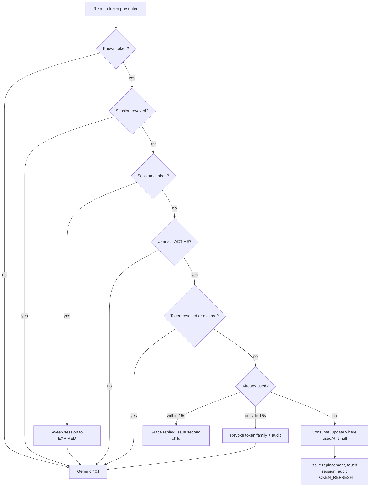

# Authentication core

This document describes the authentication and session system in this repository: how each flow works, the patterns behind it, what it defends against, and the practices that back it. It is written to be read closely — **controls that are partial or absent are marked as such**, so nothing here falls apart under review.

Stack: NestJS 11, Prisma 7 + PostgreSQL, Redis (rate limiting, email queue, optional denylist), argon2id, HS256 JWT, Google ID tokens.

Two companion documents go deeper: [SECURITY.md](SECURITY.md) for the threat register, and [GOOGLE-AUTH.md](GOOGLE-AUTH.md) for how Google sign-in was built step by step.

| | |
|------|------|
| HTTP endpoints | 11 |
| Sign-in methods | 2 (password, Google) |
| Unit tests | 323 across 29 suites |
| Integration tests | 22 against real PostgreSQL |
| End-to-end journeys | 31 |
| Spec files | 33 |
| Audit event types written | 10 |
| Validated environment rules | 61 |
| Migrations | 6 |

---

## 1. How authentication works

Seven flows are implemented end to end, through two sign-in methods that meet at one place.

### Registration and email verification

Registration hashes the password with argon2id, then creates the user, their primary email and a verification token inside one transaction. The raw token is 32 random bytes in base64url; **only its SHA-256 hash reaches the database**. The verification email is queued through BullMQ keyed on the token id, so a retry cannot send twice.

Resend is cooldown-gated per address and runs at `Serializable` isolation with retry on write conflict, so two simultaneous resends cannot both issue a token. Registration, resend and verification all answer with the same generic message whether or not the address exists.

### Login: decide, then verify, then branch

The ordering is the security design. Login decides **which hash to compare against before comparing**, so every path performs exactly one argon2 verification and costs the same wall-clock time.

1. **Normalise the email** — lower-cased, so the lookup is stable.
2. **One read, filtered to a live account** — joined query restricted to `status = ACTIVE` and `deletedAt IS NULL`. A missing address and a suspended account are indistinguishable from here on.
3. **Select the hash** — the real hash when the account exists, has a password and is not locked; otherwise a dummy argon2id hash generated at startup with *identical cost parameters*.
4. **Verify once** — on every branch, including unknown accounts. A test asserts the call count across all five branches.
5. **Branch** — unknown account, no password credential, locked, or wrong password all produce an identical 401 with an identical body. Only a wrong password advances the lockout counter.
6. **Success** — reset the failure counters, re-hash if argon2 parameters have moved on, then issue a session.

### Lockout that releases

Five wrong passwords lock the account for an hour. The counter is incremented by the database itself, so simultaneous attempts cannot lose a count.

When a lock is observed to have **expired**, the counter is cleared before the attempt is judged. Without that, the sixth attempt would re-lock immediately and the account would be stuck at one attempt per hour indefinitely. Attempts against an already-locked account are audited but **not** counted, so nobody can extend someone else's lockout by hammering it.

### Sessions and tokens

A login writes a `Session` row, a hashed `SessionRefreshToken` and a `LOGIN_SUCCESS` event in a single transaction, then mints the access token *outside* it — the token needs the committed session id, and a signing failure must not roll back a good session.

- **Access token** — 10-minute HS256 JWT carrying `sub`, `sid`, `fam`, `ev` (email verified), `mcp` (must change password), `amr`, `jti`, `iss`, `aud`, with a `kid` header so keys rotate by configuration.
- **Refresh token** — opaque, stored only as a hash, delivered exclusively in an `httpOnly` cookie scoped to `Path=/auth`.

Two lifetimes bound a session: an **absolute cap** fixed at login and never extended, and a shorter **refresh lifetime clamped to it**, which acts as the idle timeout. A per-user cap evicts the least-recently-used session rather than refusing a correct password.

### Refresh rotation and theft detection

Every refresh consumes its token and issues a new one, so a token appearing twice means two parties hold it — except that legitimate clients double-submit constantly (two calls 401 together, a retry after a dropped response). A short grace window separates the two cases.

```
t=0s ─────────────── 15s ──────────────────────────────▶
 │                    │                          │
 token consumed,      grace ends                 replay here
 replacement issued                              → whole token family revoked,
 │                                                 TOKEN_REUSE_DETECTED
 └── replay inside the window
     → treated as a double-submit:
       second child token, nothing revoked
```

Inside the window a thief's replay is indistinguishable from a legitimate retry, and that is accepted deliberately: narrowing the window trades false logouts for detection. A real-Postgres test fires two genuinely concurrent refreshes of one token and asserts **both succeed with zero theft alarms**.

Decision order inside one transaction:



Single use is guaranteed by the **conditional update**, not by the isolation level. The transaction *returns* an outcome rather than throwing, because the rejection paths write the expiry sweep and the family revocation — a throw would roll those back and leave a stolen token working.

### Google sign-in

The second sign-in method, and the test of whether the architecture holds: it added no session, cookie or token code of its own.

The frontend obtains a signed ID token from Google and posts it to `/auth/google`. We chose this over the redirect flow because all we need from Google is proof of identity — the redirect flow exists to obtain access tokens for calling Google APIs, needs a client secret, and has to hand a session back to a single-page app through a redirect.

1. **Verify the token.** Signature against Google's published keys, issuer, expiry, and — the check that matters most — **`aud` must equal one of our client IDs**. Without it, a token Google issued to an attacker's own application would be accepted here.
2. **Consume the nonce**, when the token carries one. Single-use, so a stolen token cannot be replayed within its hour of validity.
3. **Resolve the identity**, by Google's permanent `sub`, never by email:
   - Known identity → sign in.
   - Unknown, and the email is verified by Google → create an account, or link to an existing one whose email is also verified.
   - Unknown, and the existing account's email was **never** verified → the pre-account-hijacking case: link, verify the email, **remove the password**, revoke every session, and expire pending verification tokens, in one transaction.
4. **Complete sign-in** through the same `completeSignIn` password login uses, so a Google session refreshes, logs out and revokes identically.

Google sign-in never sets `mustChangePassword` (an account with no password could never clear it) and is never blocked by a password lockout (that counter is about password guessing).

Whether the deployment offers Google at all is an **application capability**, held in configuration. With it off, the route answers 404.

### Logout and change password

Logout is credentialed by the **refresh cookie**, not a Bearer token: the access token has usually expired by the time someone clicks it, and requiring one would answer a logout with a 401. It is idempotent — a second call writes nothing and still succeeds. Logout-all is Bearer-guarded, being account-wide, and records **one** event carrying a count rather than one per session.

Change password **re-authenticates**: a valid access token proves possession of a credential, not that a person is present. In one transaction it writes the new hash, stamps `passwordChangedAt`, clears the lockout state, revokes every *other* session, and retires this session's refresh tokens in favour of a fresh one — so the caller stays signed in where they are while any leaked token dies. A wrong current password returns **403, not 401**, so clients don't mistake it for an expired session and try to refresh.

---

## 2. Patterns and concepts

**Unit of work with after-commit effects** — *implemented*, `common/prisma/unit-of-work.ts`. A transaction paired with a queue of effects that must not run until it commits. Redis writes (and later, emails) are queued with `afterCommit()` rather than returned out of the transaction for a caller to perform. This let one shared revocation primitive schedule its own denylist step instead of six callers each re-implementing the plumbing — the bug it replaced was a shadowed variable that silently skipped denylisting.

**Single revocation primitive** — *implemented*, `SessionService.revokeSessions`. Logout, logout-all, session-cap eviction, the expiry sweep, theft detection and password change all revoke through one function taking a filter. Before consolidation the same logic existed six times and had already drifted: the expiry sweep revoked sessions without retiring their refresh tokens.

**Transaction ownership** — *implemented*. The use case owns the transaction; lower-level operations accept it and never open their own. Change password updates the credential, revokes other sessions and reissues a token atomically, which is impossible if each service opens its own transaction.

**Convergence on one authentication result** — *implemented*. Password authentication produces a normalised `AuthenticationResult` handed to session creation. Providers never mint sessions or tokens themselves, so Google, magic link and passkey authentication can be added without touching session handling.

**External identity resolution** — *implemented*, `identity/identity.service.ts`. Provider-agnostic: it receives an `ExternalIdentityProfile` and never learns what Google calls its claims, so a second provider needs no changes there. Translating one provider's vocabulary into ours is the verifier's job alone.

**Test seams** — *implemented*, `GoogleTokenVerifier`. Real Google ID tokens cannot be obtained in a test run, so the one class that talks to Google is its own injectable. The e2e suite replaces it with `.overrideProvider()` and exercises everything else — guards, validation, identity resolution, sessions, cookies, database — for real.

**Application capability vs organisation policy** — *partly implemented*. Google sign-in is the first capability: a configuration flag decides whether the deployment offers it at all, checked in the authenticator so every caller is covered. Organisation-level policy remains designed, not built. Two distinct layers: what the deployment can offer at all (capability, configuration) and what a given organisation allows or requires (policy, per-tenant). Available authentication is the intersection. Deliberately deferred — a login request must not query an organisation before organisation context is known.

**Multi-organisation membership** — *schema ready*. A user may belong to many organisations with conflicting policies, so **authentication authenticates the user, never an organisation**. Tables for organisations, memberships, roles, permissions and invitations exist; organisation context resolution is an explicit open design question rather than an implicit "email implies organisation" rule.

**Token family** — *implemented*, `Session.tokenFamilyId`. Rotation chains are grouped, so a detected replay revokes every session in the family rather than only the one presented.

**Soft cap with LRU eviction** — *implemented*. At the per-user session limit the least-recently-used session is evicted instead of rejecting the login: rejecting would refuse a correct password and let anyone who knows it lock the owner out by filling their slots. Documented as a **soft** cap — two simultaneous logins can leave the user one over the limit, and making it hard would mean serialising the login path.

**Idempotent state transitions** — *implemented*. Every revocation is guarded on `revokedAt: null`, so repeats change nothing, write no duplicate audit event and preserve the original timestamp. Queue jobs carry an idempotency key for the same reason.

**Audit separate from control** — *implemented*. Every failure is recorded; only a real password guess advances the lockout counter. Recording is not punishing — conflating them is how a defence becomes a weapon. Events carry a nullable `userId` so failures on unknown addresses can still be audited.

**Fail-closed vs fail-open, chosen per case** — *implemented*. Route protection is opt-out: a new route is guarded unless marked `@Public()`, so a forgotten decorator is *more* restrictive. The denylist is the opposite — it fails open on a Redis outage, because it narrows an already-short window and must not take authentication down with it.

**Single-source password policy** — *implemented*, `MeetsPasswordPolicy`. One composed decorator carries length, complexity, a common-password blocklist and a breach check. Registration and change password apply it; login and "current password" fields deliberately do **not**, because policy governs what may be *created* — enforcing it on verification locks out anyone whose password predates a policy change.

**Boundary sanitisation** — *implemented*, `buildAuthContext` + `ip.util`. Client-controlled values are validated once where the request context is built, not at each write site. Five different writers consume the same sanitised context.

**Concurrency control, chosen per operation** — *implemented*. Verification resend uses `Serializable` with retry on write conflict. Rotation uses Read Committed plus a conditional update, because the update itself is the guarantee and serialising the hottest path buys nothing. Both are proven by tests that force genuine overlap against a real database.

---

## 3. Security measures and what they prevent

### Credential and identity attacks

| Threat | Mechanism | Status | Pinned by |
|------|------|------|------|
| User enumeration | Identical status and body for unknown account and wrong password; one shared message constant; generic responses on register/resend/verify | Enforced | Unit + e2e parity tests |
| Timing side channel | Exactly one argon2id verification on every branch, against a startup dummy hash with identical cost parameters | Enforced | Verification-count test, 5 branches |
| Offline cracking of stolen hashes | argon2id, pinned parameters (64 MiB, 3 iterations, parallelism 4); re-hash on login when parameters change | Enforced | Upgrade-on-login test |
| Weak and breached passwords | Length + complexity rules, common-password blocklist, HIBP k-anonymity range check (fails open on outage) | Enforced | e2e policy rejection |
| Online brute force on one account | Lockout after 5 failures for 1 hour, counter cleared when an expired lock is observed | Enforced | Expired-lock reset test |
| Lockout weaponised as DoS | Only a genuine wrong-password guess counts; unknown, credential-less, already-locked, and wrong-current-password are audited but never counted | Enforced | Non-counting branch tests |
| Credential stuffing / spraying | Redis-backed per-IP limits: 60/min global, 5/min on auth routes, via named profiles | **Partial** — bounded per IP; distributed spraying remains open | Live 429 check |
| Soft-deleted or suspended account authenticating | Login filters `status = ACTIVE` and `deletedAt IS NULL`; refresh re-checks user status on every rotation | Enforced | Suspended-user rotation test |

### Session and token attacks

| Threat | Mechanism | Status | Pinned by |
|------|------|------|------|
| Refresh token replay / theft | Single-use rotation via conditional update; replay outside the grace window revokes the whole token family and records `TOKEN_REUSE_DETECTED` | Enforced | Real-Postgres reuse test |
| False theft alarms logging users out | 15-second grace window treats a recently-used token as a double-submit, issuing a second child rather than revoking | Enforced | Concurrent-refresh test with transaction overlap barrier |
| Token theft via XSS | Refresh token in an `httpOnly` cookie, never in a response body; access token held in memory with a 10-minute life | Enforced | Body-leak assertions, unit + e2e |
| Database disclosure yielding usable tokens | Refresh and verification tokens stored only as SHA-256 of 256-bit random values | Enforced | Hash round-trip tests |
| CSRF on cookie-credentialed routes | `SameSite=Lax` blocks cross-site POSTs; CORS pinned to one origin so a forged request cannot read the response; all other routes use Bearer and are inherently immune | **Partial** — adequate same-site; a cross-site frontend needs double-submit tokens | — |
| Indefinite session lifetime | Absolute cap fixed at login, never extended; shorter refresh lifetime clamped to it as an idle timeout; expired sessions swept lazily on use | Enforced | Clamp test (forced inverted config) |
| Session accumulation | Per-user cap with LRU eviction, recorded as `SESSION_LIMIT` | Enforced | Cap + convergence tests |
| Revoked session still usable | Refresh revoked immediately; the access token stays valid until expiry **unless** the Redis denylist is enabled, which rejects revoked session ids with one lookup | **Optional** — ships disabled | Verified live in both flag states |
| Stolen token surviving a password change | Password change revokes every other session and retires this session's refresh tokens, issuing a replacement, in one transaction | Enforced | e2e multi-device journey |

### Protocol, transport and platform

| Threat | Mechanism | Status | Pinned by |
|------|------|------|------|
| JWT algorithm confusion, incl. `alg: none` | Verification pins `algorithms: ['HS256']`; issuer and audience checked; 5s clock tolerance; `kid` header for rotation | Enforced | Forged `alg: none` and foreign-secret tests |
| Unauthenticated access to protected routes | Global guard protects every route unless marked public, ordered *after* rate limiting so floods are bounded before signature work | Enforced | Guard spec + e2e 401 checks |
| Spoofed client IP defeating limits and audit | Proxy trust is explicit configuration; every IP validated with `net.isIP` and stored null when malformed | Enforced | Table-driven IP tests |
| Malformed input aborting a transaction | A bad `X-Forwarded-For` once reached a Postgres `inet` column, aborted the transaction and silently discarded the failed-attempt increment — a lockout bypass. Now normalised at the boundary and again inside the audit writer | Fixed | Documented raw-cast test |
| Oversized client headers | Device id clamped to 255 chars, user agent to 1000, request bodies to 256 KB | Enforced | Clamp tests |
| SQL injection | All access through Prisma's parameterised query builder; no string-concatenated SQL in application code | Enforced | By construction |
| Transport downgrade and common web attacks | Helmet supplies HSTS, CSP, `nosniff`, frame options, referrer policy, cross-origin isolation; refresh cookie is `Secure` and boot refuses to start in production without it | Enforced | Cross-field env validation |
| Secrets leaking into logs | Structured logging redacts 15 paths: authorization and cookie headers, passwords, raw tokens, access/refresh tokens, hashes, API keys | Enforced | Configured redaction list |
| Internal detail leaking through errors | One exception filter returns an allow-listed body — status, message, optional code, request id — never the exception payload; unexpected errors become a generic 500 and are logged with a stack | Enforced | Leak test with a planted hash and query |
| Misconfiguration reaching production | 58 validated env rules, incl. a 32-char minimum on the signing secret and cross-field rules forcing secure cookies in production and when `SameSite=None`. The process refuses to boot otherwise | Enforced | Boot-time schema validation |
| Multi-factor / step-up authentication | Not implemented. Re-authentication is enforced for password change and the OTP challenge model exists in the schema, but there is no second factor | **Not built** | Roadmap after password reset |

### What this system does not yet defend against

- Distributed credential spraying across many accounts from many addresses.
- A cross-site frontend without double-submit CSRF tokens.
- Up to 10 minutes of continued access-token validity after a session is revoked, with the denylist disabled as it ships.

Each is a known, documented trade-off rather than an oversight.

---

## 4. Enterprise practices

- **Layered test strategy** — 323 unit tests for logic and branch coverage; 22 integration tests against real PostgreSQL for anything depending on genuine transaction semantics; 31 end-to-end journeys through the deployed configuration.
- **Tests verified to fail** — critical guarantees are checked by deliberately reintroducing the bug and confirming the right test goes red. This has caught coverage gaps a green suite hid, including one where the after-commit rule was protected by nothing at all.
- **Real concurrency, not mocked** — a transaction overlap barrier holds simultaneous transactions until all have arrived, then releases them together, reproducing races against a real MVCC engine.
- **Shared bootstrap** — `configureApp()` is applied by both `main.ts` and the e2e harness, so tests exercise the deployed configuration rather than a bare `AppModule` with no validation pipe or cookie parser.
- **Configuration as contract** — every setting declared, typed and validated at boot with cross-field rules. No magic numbers: lifetimes, limits, cooldowns, grace windows and cost parameters are all named configuration.
- **Auditability by design** — 9 event types record logins, failures with reasons, refreshes, reuse detection, revocations with causes, logouts and password changes, with IP, user agent, device and session correlation. One event per user action, never one per affected row.
- **Reversible schema evolution** — 4 ordered migrations, each reviewed before application; additive enum values and indexes rather than destructive edits.
- **Operational observability** — structured JSON logs with a propagated request id echoed in every error response, so a user-reported failure maps to one log line. A liveness endpoint verifies real database connectivity.
- **Decisions recorded where they live** — why the grace window tolerates reuse, why the session cap is soft, why logout is cookie-credentialed, why a wrong current password returns 403. The next reader inherits the argument, not just the result.
- **Graceful lifecycle** — shutdown hooks close database and Redis connections; queue workers use bounded retries with exponential backoff and preserve failed jobs for inspection.
- **Extension without rework** — authentication mechanisms converge on one result type and one session service. Provider classes are deliberately deferred until a second implementation exists, to avoid generalising from one example.

---

## Honest scope

**Runs today:** registration, email verification and resend, password login, **Google sign-in with account linking and nonce replay protection**, sessions, access and refresh tokens, rotation with reuse detection, logout and logout-all, session capping, change password, optional access-token denylist, and a scheduled cleanup job for expired tokens and nonces.

**Schema ready, not implemented:** organisations, memberships, roles and permissions, invitations, OTP challenges, plans and feature flags, and `OAuthState` reserved for a future OIDC redirect flow.

**Designed, not built:** organisation authentication policy and the capability/policy intersection; organisation context resolution for multi-organisation users.

**Next:** frontend (which also completes Google nonce binding) → password reset → organisations and membership → role-based authorisation → auth policy → multi-factor.

---

## Before a production deployment

- Replace the placeholder signing secret, issuer and audience with real values.
- **Check the two session lifetimes are the right way round** (`SESSION_ABSOLUTE_TTL_SECONDS` must be ≥ `SESSION_REFRESH_TTL_SECONDS`) and add the cross-field Joi rule that enforces it. They are currently swapped in `.env`; the runtime clamp keeps behaviour correct, so nothing fails loudly.
- Set proxy trust to the number of proxies actually in front of the service.
- Decide on the access-token denylist: enable it, or accept the documented revocation window.
- Turn on `AUTH_GOOGLE_NONCE_REQUIRED` once the frontend passes a nonce to Google. Startup validation already refuses to run without it in production.
- Replace the development Google OAuth client with a production one, without the OAuth Playground redirect URI.
- Add double-submit CSRF tokens if the frontend is served from a different site.
